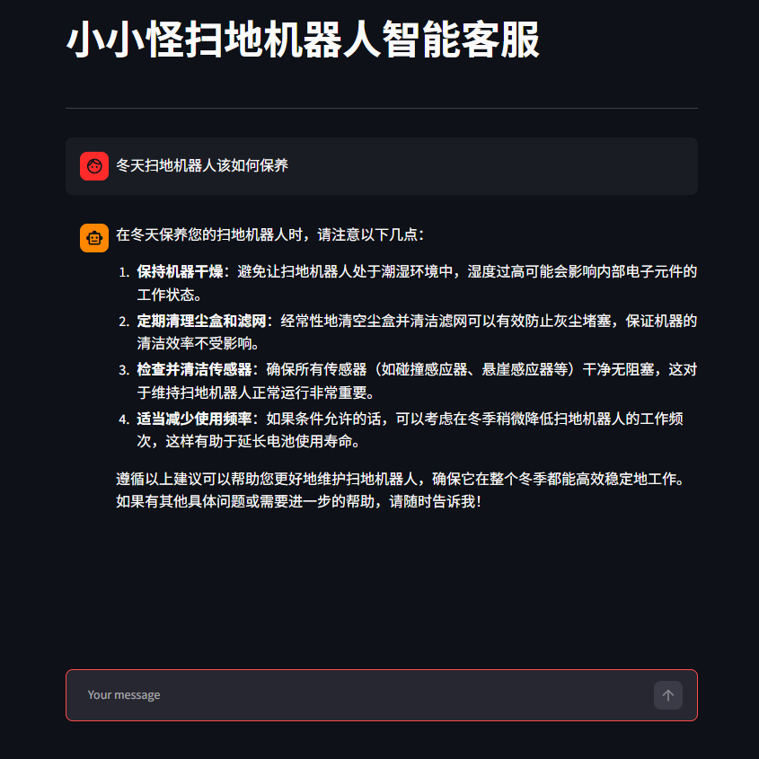
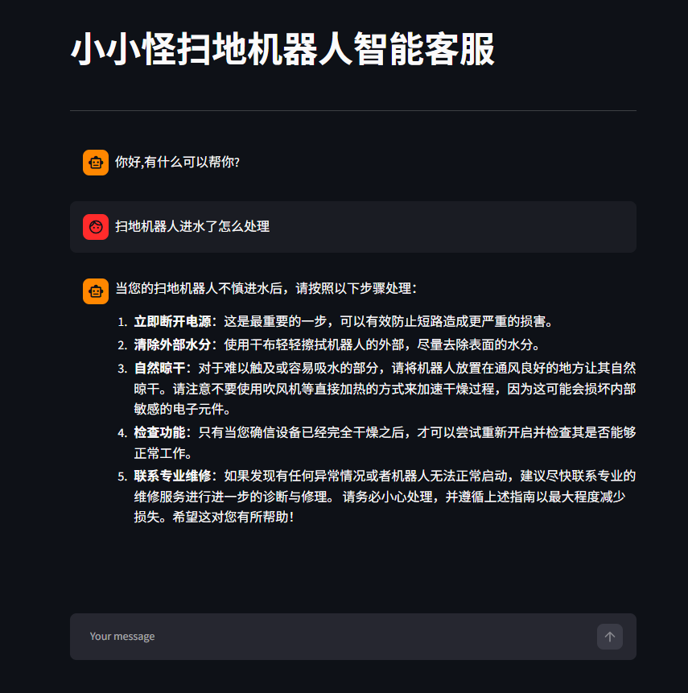
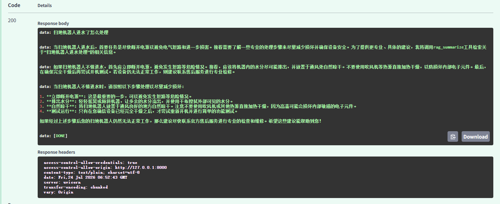

# 小小怪扫地机器人智能客服 · LangChain ReAct Agent

> 基于 LangChain + LangGraph 构建的 ReAct 智能客服系统，集成 RAG 检索增强、多工具自动调用与动态提示词切换，支持 Streamlit 流式界面和 FastAPI 服务两种部署方式。

---

## ✨ 项目特性

| 特性 | 说明 |
|------|------|
| **ReAct 推理范式** | Thought → Action → Observation 循环，Agent 自主推理决定调用工具 |
| **RAG 检索增强** | Chroma 向量库 + DashScope Embedding，MD5 文件去重，支持 TXT/PDF 混合加载 |
| **多工具调用** | 内置 7 个工具，Agent 按需自动选择组合使用 |
| **动态提示词切换** | Middleware 根据运行时上下文自动切换「普通问答」与「报告生成」两套 Prompt |
| **中间件机制** | 工具调用监控、模型调用日志、动态 Prompt 注入，可扩展 |
| **流式输出** | 支持 SSE 流式响应，逐字展示 Agent 思考过程 |
| **双模式部署** | 单机版（Streamlit 直连） / 前后端分离（FastAPI + Streamlit） |
| **配置驱动** | YAML 配置文件统一管理 Agent / RAG / Chroma / Prompts 参数 |

---

## 🛠 技术栈

| 层级 | 技术选型 |
|------|----------|
| **大语言模型** | 通义千问 qwen-max（DashScope） |
| **向量模型** | text-embedding-v4（DashScope） |
| **Agent 框架** | LangChain + LangGraph |
| **向量数据库** | Chroma |
| **文档处理** | PyPDF + RecursiveCharacterTextSplitter |
| **Web 框架** | FastAPI（后端） |
| **前端界面** | Streamlit |
| **配置管理** | YAML |
| **数据校验** | Pydantic |

---

## 📁 项目结构

```
Agent项目案例/
│
├── agent/                          # Agent 核心模块
│   ├── __init__.py
│   ├── react_agent.py              #   ReAct Agent 主类（流式执行）
│   └── tools/                      #   工具与中间件
│       ├── agent_tools.py          #     工具函数集合（7个工具）
│       └── middleware.py           #     中间件（监控/日志/动态提示词）
│
├── rag/                            # RAG 检索增强
│   ├── vector_store.py             #   Chroma 向量库 · 文档加载 · MD5 去重
│   ├── rag_service.py              #   RAG 检索 → LLM 总结服务
│   └── chroma_db/                  #   向量库持久化目录
│
├── model/
│   └── factory.py                  # 模型工厂（ChatTongyi + DashScopeEmbedding）
│
├── config/                         # YAML 配置文件
│   ├── agent.yml                   #   Agent 配置（外部数据路径）
│   ├── chroma.yml                  #   向量库与检索参数
│   ├── rag.yml                     #   RAG 模型选型
│   └── prompts.yml                 #   提示词文件路径配置
│
├── prompts/                        # 提示词模板
│   ├── main_prompt.txt             #   普通问答 System Prompt
│   ├── rag_summarize.txt           #   RAG 总结 Prompt
│   └── report_prompt.txt           #   报告生成 System Prompt
│
├── utils/                          # 工具函数
│   ├── config_handler.py           #   YAML 配置加载
│   ├── file_handler.py             #   文件解析（PDF/TXT）
│   ├── logger_handler.py           #   日志管理
│   ├── path_tool.py                #   路径工具
│   └── prompt_loader.py            #   提示词加载
│
├── data/                           # 知识库文档（扫地机器人相关）
│   └── external/                   #   外部用户使用数据（CSV）
│
├── assets/                         # 效果展示截图
├── logs/                           # 日志输出目录
├── chroma_db/                      # 顶层向量库目录
│
├── app.py                          # 【单机版】Streamlit 直接调用 Agent
├── app_new.py                      # 【分离版】Streamlit 前端（调用 FastAPI）
├── main.py                         # FastAPI 后端服务
├── schemas.py                      # Pydantic 请求模型
├── md5.txt                         # 知识库文件 MD5 记录（去重用）
├── .env                            # API Key 配置
├── .gitignore
└── README.md
```

---

## 🚀 快速开始

### 1. 环境要求

- Python 3.11+
- 阿里云百炼 API Key

### 2. 安装依赖

```bash
pip install langchain langchain-chroma langchain-text-splitters \
    langchain-openai dashscope fastapi uvicorn streamlit \
    pypdf pydantic python-dotenv pyyaml requests
```

### 3. 配置 API Key

在 [阿里云百炼控制台](https://bailian.console.aliyun.com/) 申请 API Key，然后在项目根目录创建 `.env` 文件：

```env
DASHSCOPE_API_KEY=你的APIKey
```

### 4. 准备知识库

将扫地机器人相关的 TXT 或 PDF 文件放入 `data/` 目录，系统会自动加载并向量化（首次运行时自动执行，MD5 去重避免重复加载）。

### 5. 启动方式

#### 方式一：单机版（Streamlit 直连 Agent）

```bash
streamlit run app.py
```

访问 http://localhost:8501 即可使用。

#### 方式二：前后端分离版（FastAPI + Streamlit）

**启动后端服务：**

```bash
python main.py
# 或
uvicorn main:app --host 127.0.0.1 --port 8000 --log-level info
```

**启动前端界面：**

```bash
streamlit run app_new.py
```

访问 http://localhost:8501，前端通过 HTTP 调用后端 API。

---

## 🔧 工具列表

Agent 内置以下工具，根据用户问题自动选择调用：

| 工具名 | 功能说明 |
|--------|----------|
| `rag_summarize` | 从向量知识库检索资料并由 LLM 总结回答 |
| `get_weather` | 获取指定城市天气（模拟数据） |
| `get_user_location` | 获取用户所在城市（模拟数据） |
| `get_user_id` | 获取用户 ID（模拟数据） |
| `get_current_month` | 获取当前月份（模拟数据） |
| `fetch_external_data` | 从外部 CSV 获取用户月度使用记录 |
| `fill_context_for_report` | 触发报告生成模式，切换为报告专用 Prompt |

---

## ⚙️ 配置说明

### chroma.yml — 向量库配置

```yaml
collection_name: agent          # 向量集合名
persist_directory: chroma_db    # 持久化目录
k: 3                            # 检索返回 Top-K 条
data_path: data                 # 知识库文件目录
md5_hex_store: md5.txt          # MD5 去重记录文件
allow_knowledge_file_type: ["txt", "pdf"]  # 支持的文件类型
chunk_size: 200                 # 文本分片大小
chunk_overlap: 20               # 分片重叠字符数
separators: ["\n\n", "\n", ".", "!", "?", "。", "！", "？", " ", ""]
```

### rag.yml — 模型配置

```yaml
chat_model_name: qwen-max           # 对话模型
embedding_model_name: text-embedding-v4  # 向量模型
```

### agent.yml — Agent 配置

```yaml
external_data_path: data/external/records.csv  # 外部用户数据路径
```

---

## 🌐 API 接口

### 流式对话接口（推荐）

```
POST /api/chat/stream
Content-Type: application/json
```

**请求体：**

```json
{
  "query": "扫地机器人进水了怎么处理",
  "history": []
}
```

**响应：** SSE 流式文本，每帧格式为 `data: {chunk}\n\n`，结束标记为 `data: [DONE]\n\n`。

### 普通对话接口

```
POST /api/chat
Content-Type: application/json
```

**请求体：** 同上

**响应：**

```json
{
  "code": 200,
  "msg": "success",
  "data": "完整的回答文本..."
}
```

---

## 🧠 核心架构

### ReAct Agent 工作流

```
用户提问
   ↓
┌─────────────────────────────────┐
│  LLM 推理（Thought）            │
│  分析问题 → 决定是否调用工具     │
└─────────────┬───────────────────┘
              │
        需要工具？
         /       \
       是         否
       /           \
┌────▼────┐    ┌──▼──────────┐
│ 选择工具 │    │ 直接生成回答 │
│ 执行调用 │    └─────────────┘
└────┬────┘
     │
┌────▼────┐
│ 观察结果 │
│ (Observation) │
└────┬────┘
     │
     └──→ 回到 LLM 推理（循环直到得出最终答案）
```

### 动态提示词切换机制

通过 `fill_context_for_report` 工具触发中间件设置 `context["report"] = True`，
后续每轮模型调用前，`report_prompt_switch` 中间件自动检测并切换为报告生成专用 Prompt。

---

## 📸 效果展示

-   Streamlit 直接显示结果——`app.py`



-   Streamlit调用FastAPI接口结果——`app_new.py`

    

-   Fast API后端返回结果

    

---

## 📝 日志

系统运行日志自动输出到 `logs/` 目录，包含：
- 工具调用记录（名称、参数、结果）
- 模型调用前消息统计
- 知识库加载状态（成功 / 跳过 / 失败）
- 错误堆栈追踪

---

## 🙌 致谢

- [LangChain](https://github.com/langchain-ai/langchain) - Agent 框架
- [LangGraph](https://github.com/langchain-ai/langgraph) - 状态图运行时
- [Chroma](https://github.com/chroma-core/chroma) - 向量数据库
- [Streamlit](https://streamlit.io/) - 快速数据应用框架
- [FastAPI](https://fastapi.tiangolo.com/) - 高性能 Web 框架
- [阿里云百炼](https://bailian.console.aliyun.com/) - 大模型服务
- Black Horse - 课程参考
